## wsl setup

- install ubuntu wsl
    - `wsl --install -d Ubuntu`
        - noteer eerst je gebruiker en password voor je ubuntu (deze heb je later nodig)
        - maak nu een gebruiker en password aan (dit wordt gevraagd)
        
- open je wsl (wij gebruiken Ubuntu als distro)
    - `wsl -d Ubuntu`
    - je ziet nu dat je in een mnt directory zit:
        > 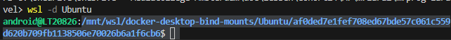
- ga naar je home 
    - `cd ~`
- maak een directory voor je laravel development
    - `mkdir laradev`
- ga naar de directory
    - `cd laradev`

## NPM in linux
- type `which npm`
    - zie je iets als /mnt/c
        ```bash
        sudo apt-get update
        sudo apt-get install -y npm
        ```
- type nu `which npm`
    - dit zou nu een linux pad moeten zijn en anders dan eerst

## NODE in linux
- type which node
    - zie je iets als /mnt/c
    - kopieer in je wsl terminal:
    
        ```bash
        curl -fsSL https://deb.nodesource.com/setup_22.x | sudo bash - 
        sudo apt-get update
        sudo apt-get install -y nodejs
        ```
    > had je node al? dan `sudo apt-get remove nodejs`
- type nu `which node`
    - dit zou nu een linux pad moeten zijn en anders dan eerst


## laravel project opzetten

- maak een nieuw project (type of kopieer):
    - `curl -s https://laravel.build/m7prog-laravel | bash`
    > 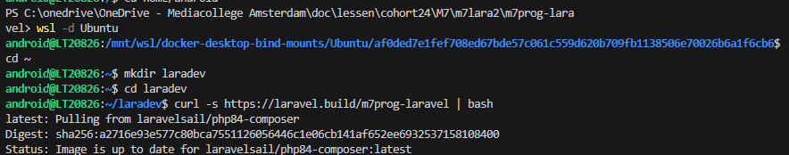

    > HINT m7prog-laravel kan je veranderen als je andere projecten start
- als het goed is heb je een wachtwoord voor je android (zo niet zie de `wsl change pw.md` )
    - type die zodra die [sudo] password... vraagt
    > 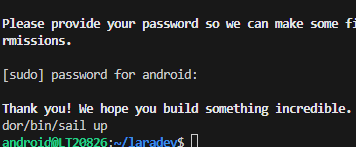


## sail up

- ga naar je project dir:
    > 
    > dat is nu m7prog-laravel

- type nu `vendor/bin/sail up`

- nu zie je:

    > 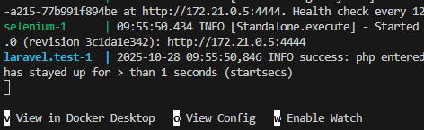

## controle

- nu draait je docker, check of je dit hebt:
    > 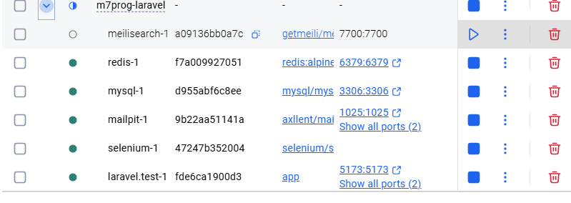

## breeze npm etc

- open je exec van je laravel docker container:
    > 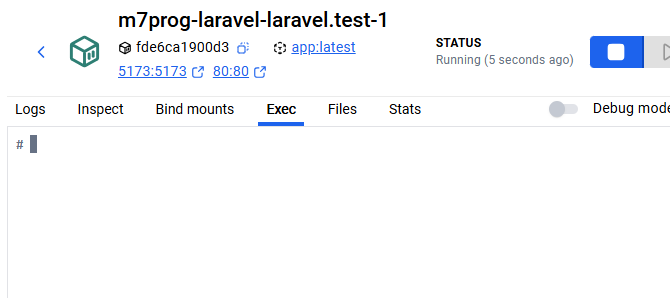
    
- installeer breeze (type in de terminal van je laravel docker):
    - composer require laravel/breeze --dev
        - `php artisan breeze:install`
        - `php artisan migrate`

- installeer npm:
    - `npm install`
- test:
    - `npm run dev`
    - je ziet:
    > 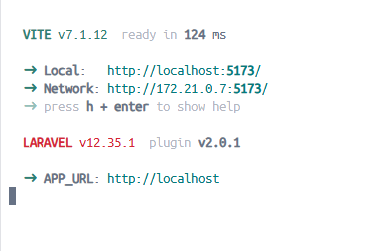
    
- open je browser je ziet nu laravel met breeze
    > 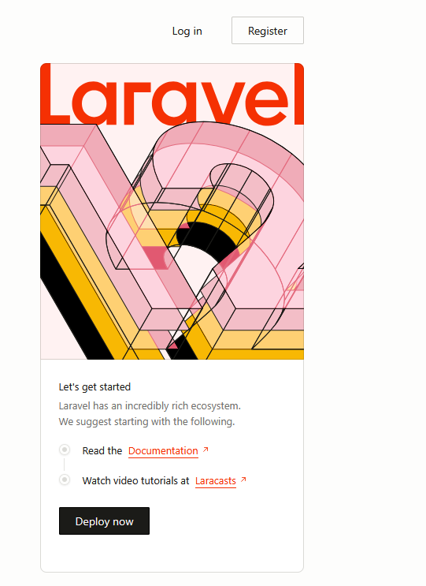

## Files in visual studio code

- al onze files staan nu in het linux file system van wsl hoe komen we daar bij?
    - open explorer (van windows)
        - in de adres balk type je:
            - `\\wsl.localhost\Ubuntu\home\android`

        - daar staat onze directory
            > 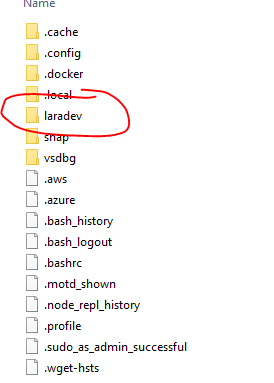
- open die directory in visual studio code
- nu kan je beginnen met coderen!


## visual studio remote (ALTERNATIEF!!)

- LEES: ALLEEN ALS: als je CMD/ url errors blijft krijgen in je terminal

    - click op remote in visual studio code:
        > 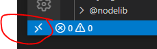
        - click op WSL
            > 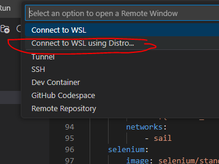
            - nu op ubuntu
                > 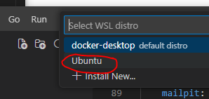
                - VS installeerd wat dingen
                - open je laravel folder 
                    > 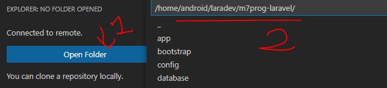
    


## RESET (werken dingen niet? )

- voor een volledige reset:
    - `wsl --unregister Ubuntu` (dit reset alles)